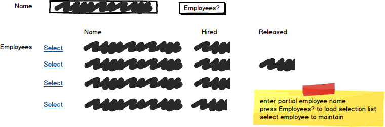

# A01: Employees

::: danger Scenario Not Available
This scenario is not available for selection at this time.
:::

You must do two web form pages (Query and CRUD) based on the following database tables.

## CRUD

> **Employees** - Single Item Create/Read/Update/Delete

- Employees cannot be deleted. Employees are terminated. Employees have a nullable `ReleaseDate` which is set to indicate the employee is no long with the school.
- Include a not mapped property called FullName when creating the Employee entity definition. This property will return a string containing the LastName, Firstname of the employee.
- Forms must allow the user to select/view position and program from a list of data currently on the database.
- **Search Filter:**
  - Use employee firstname/lastname filter search for lookup regarding updates and deletes.

## Query

> **Employees by Position** - GridView Lookup with ObjectDataSource controls

- Avoid the use of code-behind in the form wherever possible.
- Use Position drop down list for lookup. Include a prompt line with a value of 0. You may test that a selection was made in code-behind.
- Program must be displayed and positioned correctly in a drop down list on the GridView.
- Do not display the postion in your GridView.
- Customize your GridView for field size and datatype.

## Recommended Stored Procedures

The following specialty stored procedures are available:

- `Employees_FindByPosition` - Returns zero or more Employees matching the supplied position id
- `Employees_FindByPartialName` - Returns zero or more Employees whos first or last name includes the supplied string
