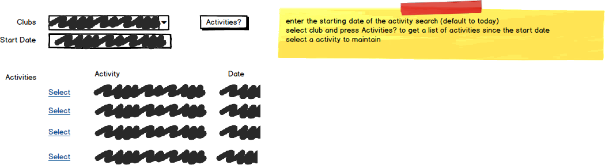

# A14: Club Activities

::: danger Scenario Not Available
This scenario is not available for selection at this time.
:::

You must do two web form pages (Query and CRUD) based on the following database tables.

## CRUD

> **ClubActivities** - Single Item Create/Read/Update/Delete

- Only future ClubActivities can be created, updated or deleted.
- ClubActivities' `StartDate` will default to Today if no start date is given when the activity is created.
- ClubActivities will have a CampusVenue assigned unless it is off campus. A CampusVenues `Description` list can be obtained from the database.
- Off campus activities must be flagged and have a location.
- The active must have either be a campus activity OR a off campus activity
- **Search Filter:**
  - Use Club and a start date filter for main Club Activities lookup (find all activites for the club since the start date):

## Query

> **ClubActivities by Club** - Gridview Lookup with ObjectDataSource controls

- Avoid the use of code-behind in the form wherever possible.

## Recommended Stored Procedures

The following specialty stored procedures are available:

- `ClubActivities_FindByClubAndDate` - Returns zero or more ClubActivities records matching the club id and is on/after the supplied date
- `ClubActivities_FindByClub` - Returns zero or more ClubActivities records matching the club id 
